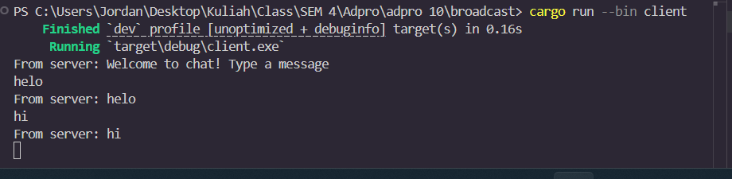
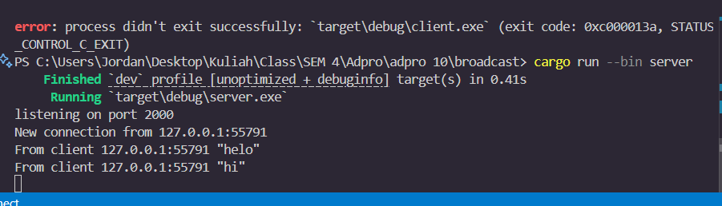
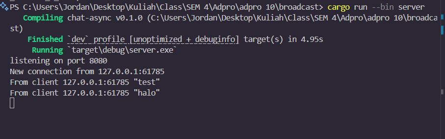
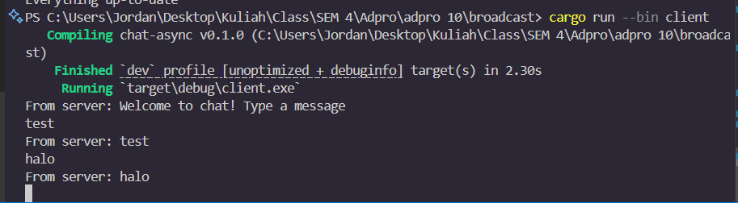
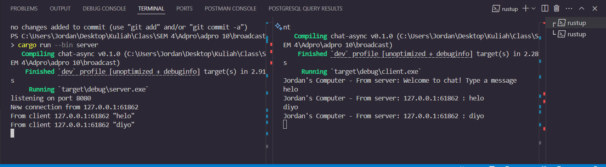

## understanding How It Works
 

The experiment demonstrates the effectiveness of asynchronous programming in real-time applications like chat. By listening for incoming connections and launching three clients, the server broadcasts messages in real-time, demonstrating the server's ability to handle multiple connections concurrently without blocking.

## Modifying the Websocket Port

the Ports for both the server and also the client need to be the same port value such both need to be 8080 to have the code work properly. if one of them are not the same we can not make a connection between the server and client.

## small changes

The experiment involved altering the server to display the sender's IP address and port in broadcasted messages, enabling easier identification of message origins without usernames. The addr's socket address was added to the server-side message, resulting in messages with the sender's source address, facilitating communication tracking in multi-client settings and increasing transparency in client-server messaging.
